## OpenStreetMap - Le projet

<br>

- Base de données cartographique **libre** et **collaborative**: licence **OdbL**  
<span style="font-size: 0.7em;color:#707070;"> *«You are free to : **share**, **create** and **adapt** the database as long as you **attribute**, **share-alike** and **keep open**»* </span>

- Informations très diverses relatives à l’**espace public**

. . .

- Depuis 2004: **10.4M** utilisateurs (particuliers & entreprises), **32Mds** points GPS

## OpenStreetMap - Les données

<br>

:::: {.columns}

::: {.column width="50%"}

##### **Formats**

::: {.column width="10%"}

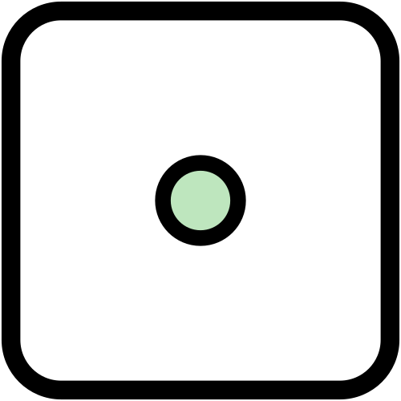{width=200px} 

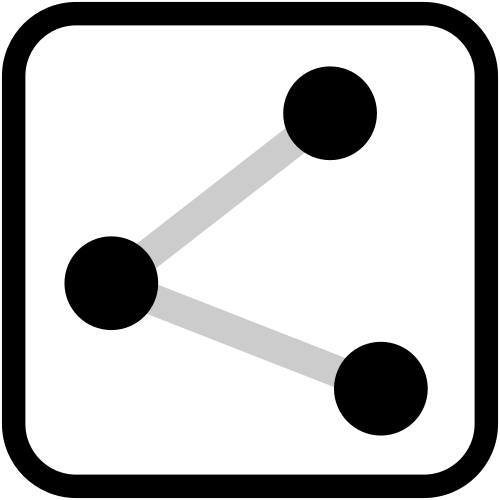{width=200px} 

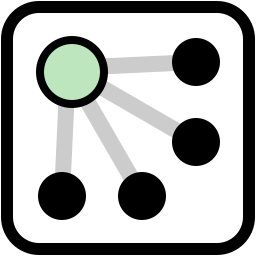{width=200px} 

:::

::: {.column width="80%"}

**Node** (nœud): point défini par une **longitude**, une **latitude** et un **id**. (+ altitude en option)

**Way** (ligne): une liste de nœuds. Peut être **ouverte** ou **fermée** (polygone)

**Relation**: permet de regrouper **différents objets**
Ex: 15 tronçons de route => 1 ligne de bus

[**Les relations ne sont pas des catégories**](https://wiki.openstreetmap.org/wiki/FR:Relations/Les_relations_ne_sont_pas_des_cat%C3%A9gories)

:::

:::

::: {.column width="50%"}

##### **Attributs**

- **Tag** (balise): informations liées à chaque objet

- Système de **clé-valeur**  
Exemple: *amenity=pub & sport=darts*

- Suivi des modifications: *changeset*

:::

::::

---

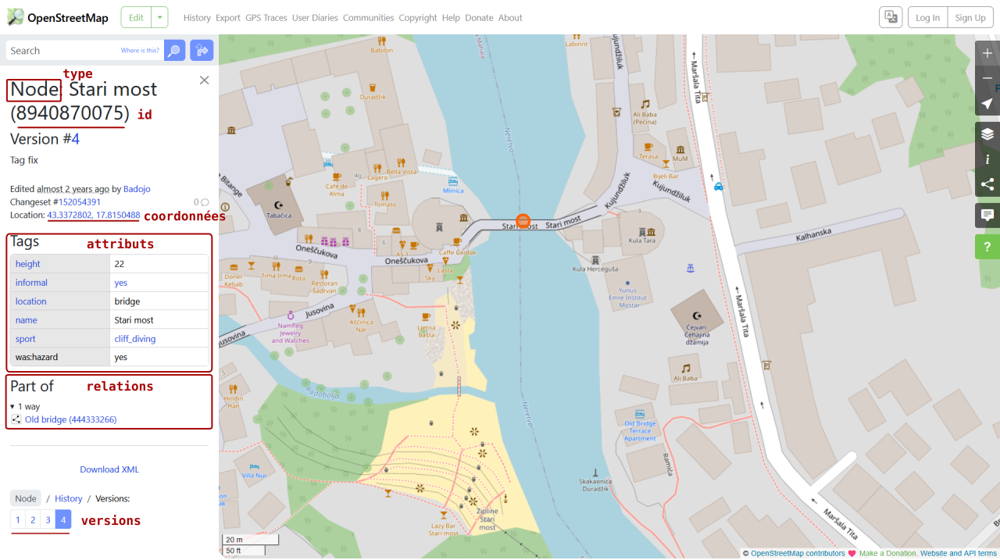

## OpenStreetMap - qualité

<br>

::: {.column width="33%"}

##### **Complétude**

**Réseau routier** «the world’s road network is ∼83% complete» 
[(Barrington-Leigh & Millard-Ball, 2017)](https://doi.org/10.1371/journal.pone.0180698)

**POIs** (Points of Interest): Hétérogénéité spatiale dans la complétude des données:

  - **Urbain** vs **rural** [(Klinkhardt et al., 2023)](https://doi.org/10.1016/j.trpro.2026.04.204)

  - Entre les pays [(Herfort et al., 2023)](https://doi.org/10.1038/s41467-023-39698-6)

:::

::: {.column width="67%"}

::: {.column}

##### **Justesse sémantique**

Clé-valeur **souples**:  Erreurs volontaires ou non

Bonnes pratiques : **Wiki OSM**

:::

::: {.column}

##### **Précision géographique**

Fiable pour routes [(Moradi et al., 2021)](https://doi.org/10.1139/geomat-2021-0012)

:::

<br>

<p style="text-align:center;"> **Outils d'assurance qualité** : <span style="color:#707070;"> *JOSM Validator, Osmose, OSM Inspector, Ohsome...*  </span> </p>

:::

<br>

<p style="text-align:center">Globalement, **la justesse et la complétude augmentent avec le temps**<br>Derrière OpenStreetMap et son Wiki : une **communauté**</p>


## OpenStreetMap - utilisation

<br>

:::: {.columns}

::: {.column width="25%"}

##### **Données**

:::

::: {.column width="25%"}

##### **Tuiles**

:::

::: {.column width="25%"}

##### **Géocodage**

:::

::: {.column width="25%"}

##### **Routage**

:::

::::

:::: {.columns}

::: {.column width="50%"}

[Geofabrik](https://download.geofabrik.de/), [BBBike](https://extract.bbbike.org/): fichier *planet.pbf* (87 GB)

[API Overpass](https://overpass-turbo.eu/): filtrer par tag et par zone

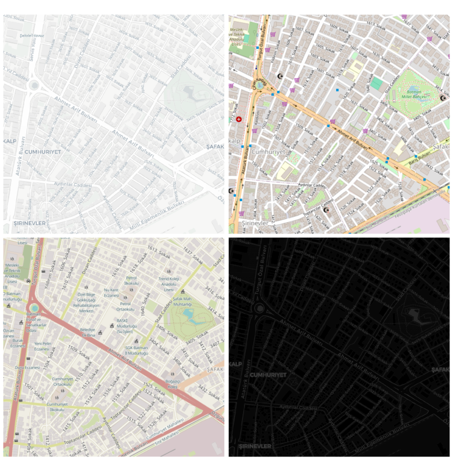{width=400px} 

:::

::: {.column width="25%"}

Retrouver une adresse depuis des coordonnées et inversement

A partir de la clé ***addr\****

{width=250px}

:::

::: {.column width="25%"}

Utiliser les **attributs du réseau** (type de route, vitesse max, stops, etc)

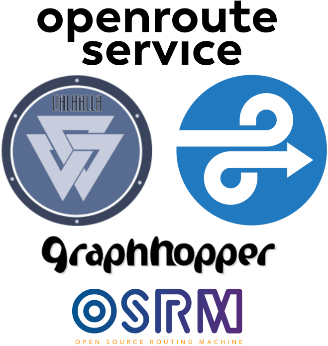{width=170px} 


:::

::::

<p style="text-align:center"> Ces outils s’interfacent via des **API** </p>

## Et dans R


<br>

:::: {.columns}

::: {.column width="25%"}

##### **Données**

:::

::: {.column width="25%"}

##### **Tuiles**

:::

::: {.column width="25%"}

##### **Géocodage**

:::

::: {.column width="25%"}

##### **Routage**

:::

::::

:::: {.columns}

::: {.column width="50%"}

<span style="color:#969696;">Geofabrik, BBBike: fichier *planet.pbf* (87 GB)</span>

<span style="color:#969696;">API Overpass: filtrer par tag et par zone</span>

:::

::: {.column width="25%"}

<span style="color:#969696;">Retrouver une adresse depuis des coordonnées et inversement</span>

<span style="color:#969696;">A partir de la clé ***addr\****</span>

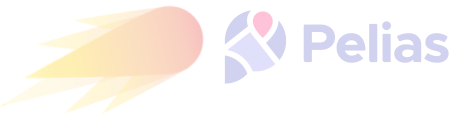{width=250px} 

:::

::: {.column width="25%"}

<span style="color:#969696;">Utiliser les **attributs du réseau** (type de route, vitesse max, stops, etc)</span>

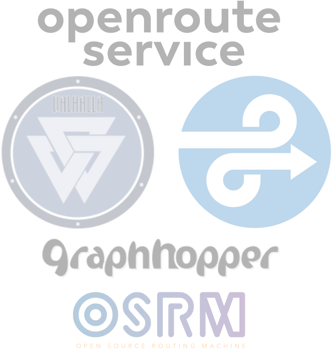{width=170px} 

:::

::::

:::: {.columns}

::: {.column width="25%"}

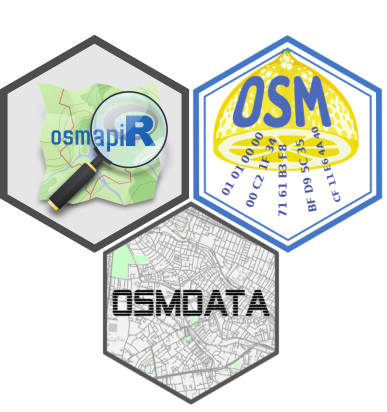{width=200px} 

:::

::: {.column width="25%"}

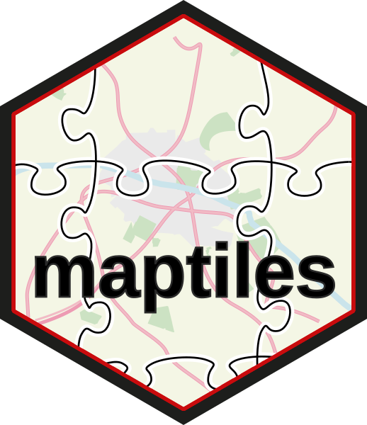{width=100px} 

:::

::: {.column width="25%"}

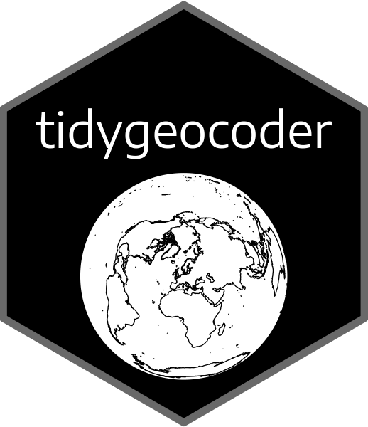{width=100px} 

:::

::: {.column width="25%"}

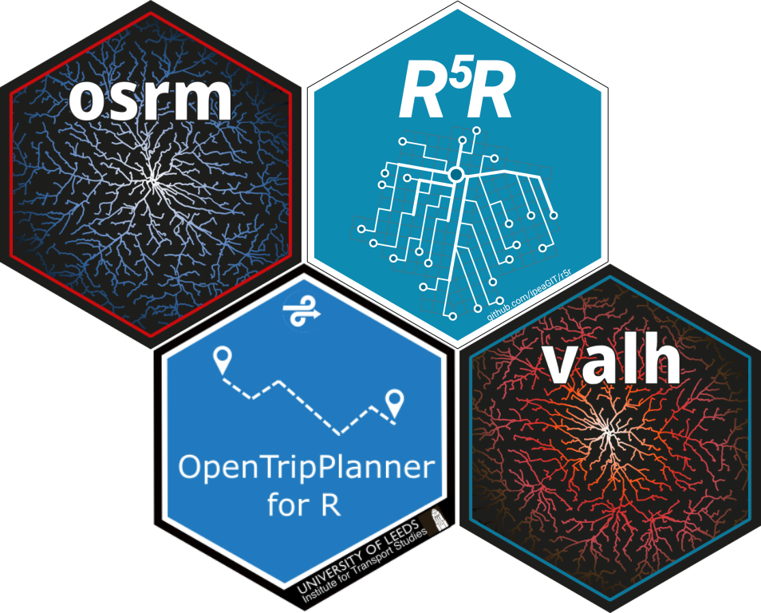{height=200px} 

:::

::::


## Démo

## Géocodage - Trouver des coordonnées à partir d'une adresse

```{r geocode}
#| code-line-numbers: "4"
library(sf) # for spatial data processing
library(tidygeocoder)
# An address in Batman
pt <- geo(address = "29 Ahmet Arif Bulvarı, Batman, Türkiye", method = "osm")# use Nominatim API
# Transform dataframe with X/Y coords to an sf object
(pt <- st_as_sf(pt, coords = c("long", "lat"), crs = 4326))
```

## Géocodage - Trouver des coordonnées à partir d'une adresse

```{r display_geocode}
#| cache: false
library(mapview)
mapview(pt)
```


## Extraction de tuiles - format Raster

```{r maptiles}
#| code-line-numbers: "3,5"
#| eval: false
library(maptiles)
# Define a bounding box around our address
bbox <- st_bbox(st_buffer(pt, 500))
# Download tiles covering the bounding box
tiles <- get_tiles(x = bbox, project = FALSE, provider = "CartoDB.Positron", zoom = 16, crop = TRUE)
tiles
```

```{r maptiles_cache}
#| echo: false
#| cache: false
library(maptiles)
tiles <- terra::unwrap(readRDS(file = "data/tiles.rds"))
tiles
```


## Extraction de tuiles - format Raster

```{r map_maptiles}
#| fig-width: 7
#| fig-height: 7.294
library(mapsf)
mf_raster(tiles)
pt <- st_transform(pt, 3857)
mf_map(pt, col = "darkgreen", cex = 3, add = TRUE)
mf_credits(maptiles::get_credit("CartoDB.Positron"))
mf_title("An address in Batman")
```


## Télécharger les données OSM - à partir de l'API Overpass

```{r osmdata}
#| code-line-numbers: "2-6"
#| eval: false
library(osmdata)
poi <- bbox |> 
  opq(osm_types = "node") |>
  add_osm_feature(key = 'amenity', value = "post_office") |>
  osmdata_sf()
poi <- poi$osm_points
flextable::flextable(poi, col_keys = names(poi))
```


```{r osmdata_cache}
#| echo: false
poi <- readRDS("data/poi.rds")
flextable::flextable(poi, col_keys = names(poi))
```


## Télécharger les données OSM - à partir de l'API Overpass

```{r map_osmdata}
#| fig-width: 7
#| fig-height: 7.294
library(mapsf)
mf_raster(tiles)
pt <- st_transform(pt, 3857)
poi <- st_transform(poi, 3857)
mf_map(pt, col = "darkgreen", cex = 3, add = TRUE)
mf_map(poi, col = "gold1", cex = 3, add = TRUE)
mf_credits(maptiles::get_credit("CartoDB.Positron"))
mf_title("An address and 2 post offices in Batman")
```


## Routage - interfacer les APIs de OSRM et de Valhalla

```{r routing}
#| code-line-numbers: "4,5"
#| eval: false
library(osrm)
library(valh)
# Shortest route from the address to the first post office
road_o <- osrmRoute(src = pt, dst = poi[1,], osrm.profile = "bike")
road_v <- vl_route(src = pt, dst = poi[1,], costing = "bicycle")
road_o
road_v
```


```{r routing_cache}
#| echo: false
road_o <- readRDS("data/road_o.rds")
road_v <- readRDS("data/road_v.rds")
(road_o)
(road_v)
```


## Cartographier les résultats


::: {.column}
```{r map}
#| fig-width: 7
#| fig-height: 7.294
#| eval: false
library(mapsf)
road_o <- st_transform(road_o, 3857)
road_v <- st_transform(road_v, 3857)
pt <- st_transform(pt, 3857)
po <- st_transform(poi[1,], 3857)
mf_raster(tiles)
mf_map(road_o, col = "darkblue", lwd = 4, add = TRUE)
mf_map(road_v, col = "darkred", lwd = 4, add = TRUE)
mf_map(pt, col = "darkgreen", cex = 3, add = TRUE)
mf_map(po, col = "gold1", cex = 3, add = TRUE)
mf_title("A Postman in Batman")
mf_scale(100, scale_units = "m")
mf_credits(txt = "© OpenStreetMap contributors © CARTO")
mf_legend(type = "typo_line", val = c("OSRM", "Valhalla"),
          pal = c("darkblue", "darkred"), pos = "topright",
          lwd = 4, val_cex = .8, title = NA)
mf_text(x = pt, txt = "Home", pos = "bottom", offset = 2)
mf_text(x = po, txt = "Post\nOffice", pos = "topright")
```
:::

::: {.column}
```{r map}
#| fig-width: 7
#| fig-height: 7.294
#| echo: false

```
:::

## Cheatsheet - P1

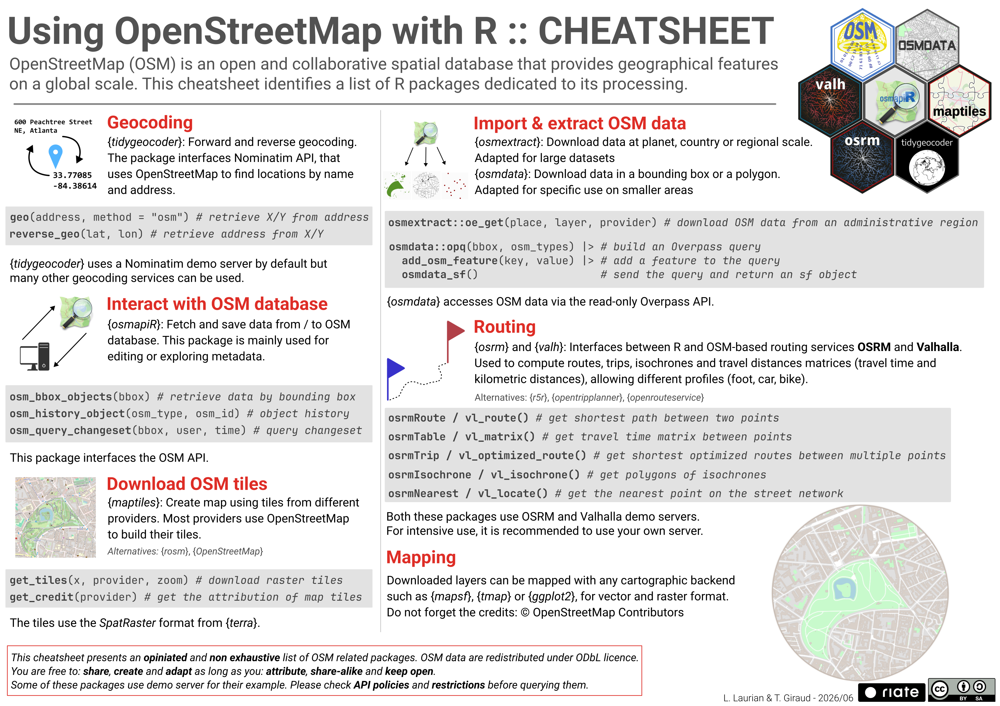{fig-align="center"}

## Cheatsheet - P2

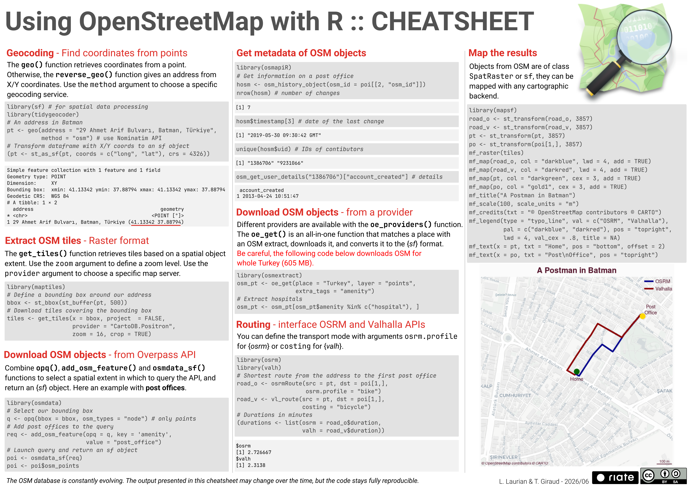{fig-align="center"}

